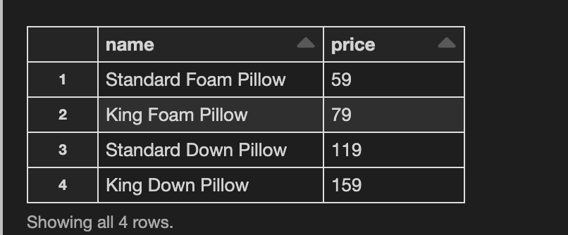

#### We can create a dataframe from a table using either SQL or DATAFRAME API in spark

example:
1. Creating a dataframe using SQL from a table called 'products'

SELECT name, price
FROM products
WHERE prics>200
ORDER BY price

This will return a data frame as shown below

2. Creating the same dataframe using spark DATAFRAME API
display(spark.table("products).select("name","price").where("price<200").groupby("price"))

So, we can create the same dataframe using two different methods as shown above
